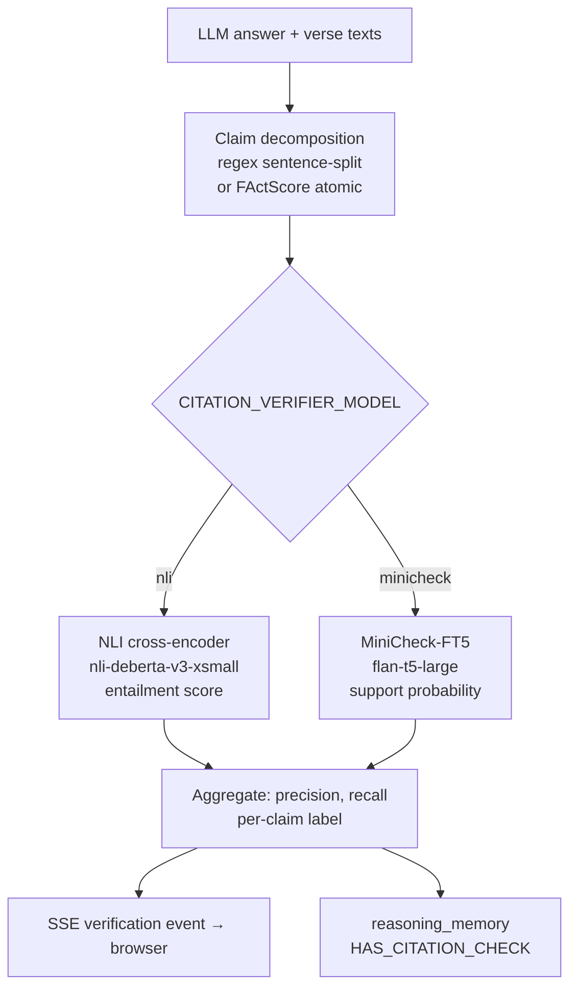

# Citation Verification

## What it does

Post-response hallucination check: verifies that each `[S:V]` citation in the LLM's answer actually supports the claim made about it. Runs after the answer streams to the user, is env-gated (`ENABLE_CITATION_VERIFY=1`), and writes verdicts to the reasoning memory graph.

## Where it lives

- `citation_verifier.py` — all logic: backends, decomposition, scoring
- Called from `app_free.py` / `app.py` after the SSE `done` event

## Pipeline



## Backend details

**NLI (`cross-encoder/nli-deberta-v3-xsmall`)** — default. Fast cross-encoder; frames each claim as `(verse_text, claim)` premise/hypothesis pair. Returns `ENTAILMENT / NEUTRAL / CONTRADICTION` with confidence.

**MiniCheck-FT5 (`flan-t5-large`)** — purpose-built grounding checker (Tang et al., EMNLP 2024). GPT-4-class faithfulness at ~400× lower cost than GPT-4. Scores `P(doc supports claim)` as a probability. Threshold: `MINICHECK_THRESHOLD=0.5`. Requires separate install: `pip install "minicheck @ git+https://github.com/Liyan06/MiniCheck.git@main"`.

## Claim decomposition

Two modes via `CITATION_DECOMPOSE` env var:

- **`regex`** (default) — sentence-split, one claim per sentence; fast, no API call.
- **`atomic`** — FActScore-style atomization via OpenRouter LLM (`DECOMPOSE_MODEL`). Each sentence is broken into independently-verifiable propositions, each tagged with citations from the parent sentence. More precise; costs a small API call per sentence.

MiniCheck receives a framing-prefix strip pass (`_strip_framing()`) that removes "The Quran teaches that…" style prefixes, which confuse the model into scoring corpus-meta-claims rather than direct propositions.

## Env knobs

```
ENABLE_CITATION_VERIFY=1              # master gate (off by default)
CITATION_VERIFIER_MODEL=nli|minicheck # default nli
MINICHECK_MODEL=flan-t5-large         # roberta-large | deberta-v3-large | flan-t5-large
MINICHECK_THRESHOLD=0.5
CITATION_DECOMPOSE=regex|atomic
DECOMPOSE_MODEL=openai/gpt-oss-120b:free
```

## Cross-references
- [[reasoning-memory]] — verdicts written as `HAS_CITATION_CHECK` edges
- [[agent-loop]] — agent loop produces the answer that gets verified
- [[overview]] — verification sits after `done` SSE event in request flow
- Source: `repo://citation_verifier.py`, `repo://app_free.py`
