# Data Pipeline — Build Sequence

## What it does

Transforms the Quran PDF into the full Neo4j knowledge graph: verse nodes, keyword edges, Arabic morphology, semantic domains, polysemy, Code-19 features, vector indexes, fulltext indexes, and reasoning memory backfill. Each step depends on the previous.

## Where it lives

All scripts at repo root. Outputs: `data/verses.json`, Neo4j `quran` database, `data/answer_cache.json`.

## Build sequence

```mermaid
flowchart TD
    A[parse_quran.py\nPDF → data/verses.json\n6,234 verses] --> B
    B[build_graph.py\nTF-IDF keywords + edges\n→ 4 CSVs] --> C
    C[import_neo4j.py\nCSVs → Neo4j\nVerse + Keyword + MENTIONS] --> D
    D[embed_verses.py\nlegacy MiniLM 384d\nverse_embedding index] --> E
    E[embed_verses_m3.py\nBGE-M3 EN+AR 1024d\nverse_embedding_m3 / _m3_ar] --> F
    F[migrate_graph.py\nschema fixes, orphan cleanup\nstopword removal] --> G
    G[load_arabic.py\nHafs Arabic text\n→ Verse.arabicText/arabicPlain] --> H
    H[build_arabic_roots.py\nmorphology → ArabicRoot + MENTIONS_ROOT\n1,223 roots, ~100K edges] --> I
    I[build_word_tokens.py\nword-level parsing\n→ WordToken + Lemma + MorphPattern] --> J
    J[build_semantic_domains.py\nsemantic field groupings\n→ SemanticDomain + IN_DOMAIN] --> K
    K[build_wujuh.py\npolysemy data] --> L
    L[import_etymology.py\nall etymology → Neo4j] --> M
    M[classify_edges.py\ntyped edges: SUPPORTS, ELABORATES\nQUALIFIES, CONTRASTS, REPEATS\n7K edges] --> N

    N[build_code19_features.py\nCode-19 arithmetic features\non Verse + Sura] --> O
    O[build_fulltext_index.py\nBM25 indexes: verse_text_fulltext\n+ verse_arabic_fulltext] --> P
    P[build_concepts.py\nPorter-stem ER → Concept nodes\n2,388 concepts + NORMALIZES_TO] --> Q
    Q[import_mutashabihat.py\nCC0 mutashabihat\n→ 3,270 SIMILAR_PHRASE edges] --> R
    R[backfill_embedding_provenance.py\nverify embedding_model/source_hash] --> S
    S[backfill_bidirectional_tfidf.py\nSefaria-style from_tfidf/to_tfidf\non MENTIONS edges] --> T
    T[backfill_retrieved_edges.py\n32K+ RETRIEVED edges\nfrom answer_cache.json] --> U
    U[analyze_graph_structure.py\ndegree distribution, betweenness\nmodularity → data/graph_stats.json]
```

## Key files and outputs

| Script | Key output |
|--------|-----------|
| `parse_quran.py` | `data/verses.json` — 6,234 verse objects |
| `build_graph.py` | TF-IDF CSV files; imports `tokenize_and_lemmatize()` (reused by `chat.py`) |
| `embed_verses_m3.py` | `verse_embedding_m3` / `verse_embedding_m3_ar` vector indexes (**preferred**) |
| `build_arabic_roots.py` | 1,223 ArabicRoot nodes, ~100K MENTIONS_ROOT edges |
| `build_fulltext_index.py` | BM25 indexes used by `hybrid_search` |
| `build_concepts.py` | 2,388 Concept nodes with NORMALIZES_TO from Keywords |
| `backfill_retrieved_edges.py` | Backfills RETRIEVED edges from cached answer history |
| `analyze_graph_structure.py` | `data/graph_stats.json` — 16 communities at modularity 0.5324 |

## Order matters

Steps 1–3 (parse → build → import) must run before anything else. Embeddings (steps 4–5) must precede any vector search. Arabic morphology (steps 7–9) must precede etymology import (step 12). Fulltext indexes (step 16) must precede `hybrid_search`. Backfill steps (R–T) are safe to re-run idempotently.

## Cross-references
- [[graph-schema]] — what the pipeline populates
- [[retrieval-pipeline]] — depends on `verse_embedding_m3` and fulltext indexes built here
- Source: `repo://CLAUDE.md` (Data Pipeline section), `repo://SETUP_GUIDE.md`
