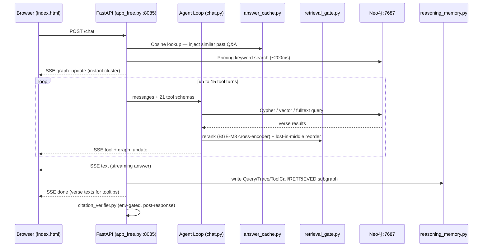

# QKG System Overview

## What it does

An agentic Quran explorer: the user asks a natural-language question, an LLM drives exploration of a Neo4j knowledge graph through 21 graph tools, and grounded answers stream back with verse citations rendered as hoverable tooltips in a 3D browser UI.

## Where it lives

All code at repo root `C:\Users\alika\Agent Teams\quran-graph-standalone\`. Entry point: `app_free.py` (:8085).

## Request flow

## Five architectural layers

| Layer | Component | File |
|-------|-----------|------|
| L1 Browser | Three.js SPA, 3D Fibonacci sphere, SSE consumer | `index.html` |
| L2 Server | FastAPI, SSE bridge, agent orchestration | `app_free.py` |
| L3 Model | Ollama / OpenRouter / Anthropic API | external |
| L4 Data | Neo4j graph (92K nodes, 403K+ edges) + answer cache | Neo4j + `data/answer_cache.json` |
| L5 ML | BGE-M3 embeddings, bge-reranker-v2-m3, NLI models | loaded lazily |

## Subsystems

- [[agent-loop]] — 21-tool agentic loop, dispatch, tool-call cache
- [[retrieval-pipeline]] — BM25 + BGE-M3 → RRF → cross-encoder → lost-in-middle
- [[graph-schema]] — full Neo4j node/relationship/index inventory
- [[reasoning-memory]] — Query/Trace/ToolCall graph written per chat
- [[citation-verification]] — NLI + MiniCheck + FActScore decomposition
- [[ralph-loop]] — self-improvement cron loop (`ralph_loop.py`)
- [[memory-stack]] — 5-tier memory model
- [[data-pipeline]] — build sequence from PDF to full graph

## Cross-references
- Source: `repo://CLAUDE.md` (Architecture section), `repo://ARCHITECTURE.md`
- ADRs: [[../decisions/0002-bge-m3-over-minilm]]
