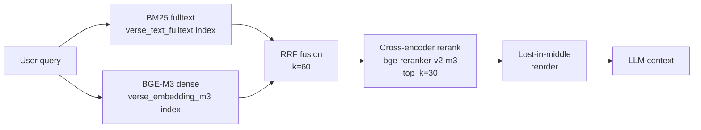

# Retrieval Pipeline

## What it does

Converts a user query into a ranked list of relevant Quranic verses. Combines sparse (BM25) and dense (BGE-M3) retrieval, fuses with RRF, then applies cross-encoder reranking and lost-in-middle reordering before the LLM sees the results.

## Where it lives

- `chat.py` — `tool_hybrid_search()`: BM25 + BGE-M3 → RRF
- `chat.py` — `tool_semantic_search()`: pure dense path via active vector index
- `retrieval_gate.py` — `rerank_verses()`, `assess_quality()`, `lost_in_middle_reorder()`, `gate_tool_result()`
- `embed_verses_m3.py` — offline: build `verse_embedding_m3` / `verse_embedding_m3_ar`

## End-to-end stages

**Stage 1 — BM25** (`verse_text_fulltext` Neo4j fulltext index, English analyzer). Used by `hybrid_search` and as a fallback in `search_keyword`. Returns verse IDs + BM25 scores.

**Stage 2 — Dense retrieval** (BGE-M3 1024d over English). Active index set by `SEMANTIC_SEARCH_INDEX=verse_embedding_m3`. Arabic variant: `verse_embedding_m3_ar`. Model loaded once via `sentence-transformers`.

**Stage 3 — RRF fusion** (k=60). Reciprocal Rank Fusion merges BM25 and dense ranked lists. Formula: `score = Σ 1/(k + rank_i)`. Implemented inline in `tool_hybrid_search()`.

**Stage 4 — Cross-encoder rerank** (`BAAI/bge-reranker-v2-m3`, multilingual). `rerank_verses()` in `retrieval_gate.py`. Scores all `(query, verse_text)` pairs, sorts descending, returns top 30. `assess_quality()` labels the result set `good / marginal / poor` based on top score vs 0.3 threshold.

**Stage 5 — Lost-in-middle reorder** (`lost_in_middle_reorder()` in `retrieval_gate.py`). LLMs attend best at context edges. Strategy: alternate placing items front/back so highest-relevance verses appear at positions 1 and N.

## Headline numbers

| Metric | Value |
|--------|-------|
| QRCD MAP@10 — legacy MiniLM | 0.028 |
| QRCD MAP@10 — BGE-M3-EN | **0.139** (5× lift) |
| Arabic queries hit@10 — English-only reranker | 0.32 |
| Arabic queries hit@10 — multilingual reranker | **0.55** |
| Dense search cold-start | ~18.8s (BGE-M3 model load) |
| Dense search warm hit (tool-call cache) | ~0ms |

## Config knobs

- `SEMANTIC_SEARCH_INDEX` — which vector index to use (default `verse_embedding_m3`)
- `RERANKER_MODEL` — cross-encoder model name (default `BAAI/bge-reranker-v2-m3`)
- `RERANK_DISABLED=1` — skip reranking entirely
- `TOOL_CACHE_TTL_SEC` — deduplicates identical calls across turns

## Cross-references
- [[agent-loop]] — `gate_tool_result()` called inside `dispatch_tool()`
- [[graph-schema]] — vector and fulltext index definitions
- ADRs: [[../decisions/0002-bge-m3-over-minilm]]
- Source: `repo://retrieval_gate.py`, `repo://chat.py` (`tool_hybrid_search`, `tool_semantic_search`), `repo://EVAL_QRCD_REPORT.md`
