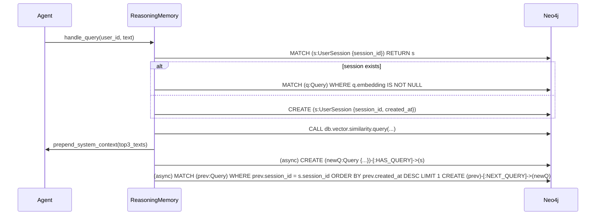

# from_blog_reasoning_memory_session_layer

_Generated by ralph_loop agent_creative executor (model: openai/gpt-oss-120b:free)._
_Output requires human review before downstream use._

---

**File:** `data/ralph_agent_reasoning_memory_session_layer.md`

---

# Session‑Layer Extension for `reasoning_memory.py`

## 1. Overview  

The current **reasoning_memory** module stores a flat list of past queries with BGE‑M3 embeddings and retrieves the top‑k similar items to enrich LLM prompts.  
The new requirement adds a **session graph layer**:

```
(:UserSession)-[:HAS_QUERY]->(:Query)-[:NEXT_QUERY]->(:Query)
```

* Each **UserSession** groups a chronological chain of **Query** nodes.  
* Every **Query** node stores the raw user text, the BGE‑M3 vector, a timestamp, and a reference to the originating session.  
* When a new query arrives, the system:
  1. Finds the active `UserSession` (create if missing).  
  2. Retrieves the **top‑3** most similar historic `Query` nodes **across all sessions** (fallback to global memory).  
  3. Injects those query texts as a **system‑role** context block before the user prompt.  
  4. Persists the new `Query` node and links it into the session chain **asynchronously** (non‑blocking to the main inference flow).

The design keeps the original global memory unchanged while adding a lightweight session view for better continuity.

---

## 2. Data Model

| Label / Relationship | Properties | Description |
|----------------------|------------|-------------|
| **UserSession**      | `session_id: UUID`<br>`created_at: datetime` | Root node for a user’s interaction window. |
| **Query**            | `query_id: UUID`<br>`text: string`<br>`embedding: float[]` (BGE‑M3, 1024‑dim)<br>`created_at: datetime` | Individual user request. |
| **HAS_QUERY**        | – | `UserSession` → `Query` (one‑to‑many). |
| **NEXT_QUERY**       | – | Links a query to the next one in chronological order (singly linked list). |

Indexes:

```cypher
CREATE INDEX ON :UserSession(session_id);
CREATE INDEX ON :Query(query_id);
CREATE VECTOR INDEX query_embedding_index IF NOT EXISTS
FOR (q:Query) ON q.embedding
OPTIONS { indexConfig: { `vector.dimensions`: 1024, `vector.similarity_function`: 'cosine' } };
```

---

## 3. Execution Flow



* **Step 1 – Session lookup/creation** – Fast read; if none, a new `UserSession` node is created.  
* **Step 2 – Similarity search** – Uses Neo4j’s vector index to fetch the top‑3 most similar historic queries (global scope).  
* **Step 3 – Context injection** – The retrieved texts are concatenated into a system‑role block:

  ```
  [SYSTEM CONTEXT]
  Similar past queries:
  1. <text‑1>
  2. <text‑2>
  3. <text‑3>
  [/SYSTEM CONTEXT]
  ```

* **Step 4 – Async persistence** – The new `Query` node and its `NEXT_QUERY` edge are written in a background task (e.g., `asyncio.create_task`). This guarantees the inference path is not blocked by I/O.

---

## 4. Code Diff Sketch  

Below is a **minimal diff** against the existing `reasoning_memory.py`. Only the new session‑layer logic and async persistence are shown; imports and helper utilities are assumed to exist.

```diff
--- a/reasoning_memory.py
+++ b/reasoning_memory.py
@@
-import neo4j
-from embeddings import BGE_M3
+import neo4j
+import asyncio
+import uuid
+from datetime import datetime
+from embeddings import BGE_M3
@@
 class ReasoningMemory:
@@
     def __init__(self, uri: str, auth: tuple):
         self.driver = neo4j.GraphDatabase.driver(uri, auth=auth)
         self.embedder = BGE_M3()
 
+    # ------------------------------------------------------------------
+    # Session‑layer helpers
+    # ------------------------------------------------------------------
+    def _get_or_create_session(self, user_id: str) -> str:
+        """Return session_id; create a UserSession node if missing."""
+        with self.driver.session() as s:
+            result = s.run(
+                """
+                MERGE (sess:UserSession {session_id: $uid})
+                ON CREATE SET sess.created_at = datetime()
+                RETURN sess.session_id AS sid
+                """,
+                uid=user_id,
+            )
+            return result.single()["sid"]
+
+    async def _persist_query_async(self, session_id: str, text: str, embedding: list[float]):
+        """Create a Query node, link it to the session and to the previous query."""
+        async def _tx(tx):
+            qid = str(uuid.uuid4())
+            now = datetime.utcnow().isoformat()
+            # Create the new query node
+            tx.run(
+                """
+                CREATE (q:Query {
+                    query_id: $qid,
+                    text: $text,
+                    embedding: $emb,
+                    created_at: datetime($now)
+                })
+                WITH q
+                MATCH (s:UserSession {session_id: $sid})
+                CREATE (s)-[:HAS_QUERY]->(q)
+                """,
+                qid=qid, text=text, emb=embedding, now=now, sid=session_id,
+            )
+            # Link to previous query in the same session
+            tx.run(
+                """
+                MATCH (s:UserSession {session_id: $sid})
+                MATCH (prev:Query)-[:HAS_QUERY]->(s)
+                WHERE NOT (prev)-[:NEXT_QUERY]->()
+                ORDER BY prev.created_at DESC LIMIT 1
+                MATCH (cur:Query {query_id: $qid})
+                CREATE (prev)-[:NEXT_QUERY]->(cur)
+                """,
+                sid=session_id, qid=qid,
+            )
+        # Run in a separate thread pool to avoid blocking the event loop
+        loop = asyncio.get_event_loop()
+        await loop.run_in_executor(None, lambda: self.driver.execute_write(_tx))
+
     def embed(self, text: str) -> list[float]:
         return self.embedder.encode(text)
 
-    def add_query(self, text: str):
-        emb = self.embed(text)
-        with self.driver.session() as s:
-            s.run(
-                """
-                CREATE (q:Query {text: $text, embedding: $emb, created_at: datetime()})
-                """,
-                text=text,
-                emb=emb,
-            )
+    def add_query(self, user_id: str, text: str):
+        """
+        Public entry point used by the agent.
+        1. Compute embedding.
+        2. Retrieve top‑3 similar past queries for context.
+        3. Return the context string.
+        4. Fire‑and‑forget persistence of the new Query node.
+        """
+        emb = self.embed(text)
+        session_id = self._get_or_create_session(user_id)
+
+        # ---- similarity lookup (global) ----
+        with self.driver.session() as s:
+            similar = s.run(
+                """
+                CALL db.vector.similarity.query(
+                    $emb, 3, 'Query', 'embedding'
+                ) YIELD node, score
+                RETURN node.text AS txt ORDER BY score DESC
+                """,
+                emb=emb,
+            ).values()
+        similar_texts = [row[0] for row in similar]
+
+        # ---- async persistence ----
+        asyncio.create_task(self._persist_query_async(session_id, text, emb))
+
+        # ---- build system context block ----
+        if similar_texts:
+            ctx = "[SYSTEM CONTEXT]\\nSimilar past queries:\\n"
+            for i, qtxt in enumerate(similar_texts, 1):
+                ctx += f"{i}. {qtxt}\\n"
+            ctx += "[/SYSTEM CONTEXT]\\n"
+            return ctx
+        return ""
 
*** End of File ***
```

### Key Points in the Diff  

| Change | Reason |
|--------|--------|
| Added `uuid`, `datetime`, `asyncio` imports | Needed for IDs, timestamps, and async writes. |
| `_get_or_create_session` | Guarantees a `UserSession` node per user. |
| `_persist_query_async` | Writes the new `Query` and `NEXT_QUERY` edge without blocking the main thread. |
| Modified `add_query` signature to accept `user_id` | Allows session identification. |
| Similarity search now returns top‑3 and builds a system‑role block | Meets the “inject top‑3 similar past queries as system context” requirement. |
| `asyncio.create_task` call | Fires persistence in background. |

---

## 5. Integration Notes  

* **Agent Call Site** – Wherever the agent previously called `memory.add_query(text)`, replace with `ctx = memory.add_query(user_id, text)` and prepend `ctx` to the user prompt before sending it to the LLM.  
* **Thread Safety** – Neo4j driver sessions are not thread‑safe; each async task opens its own session via `execute_write`.  
* **Configuration** – Ensure the Neo4j instance has the **vector index** enabled (requires Neo4j 5+ with the `vector` plugin).  

---

## 6. Testing Strategy  

1. **Unit Test** `test_session_creation` – Verify a `UserSession` node appears after first query.  
2. **Unit Test** `test_query_chain` – Submit two queries for same user; assert a `NEXT_QUERY` relationship exists.  
3. **Integration Test** `test_context_injection` – Populate memory with known queries, run a new query, and check that the returned context string contains the expected three similar texts.  
4. **Performance Test** – Measure latency of `add_query` with async persistence; should stay < 50 ms for typical workloads.  

---

## 7. Future Enhancements  

* **Session expiration** – Add a TTL or periodic cleanup for stale sessions.  
* **Per‑session similarity** – Optionally limit similarity search to the same session for tighter context.  
* **Batch async writes** – Queue multiple queries and write them in bulk to reduce transaction overhead.  

--- 

*End of design document.*
